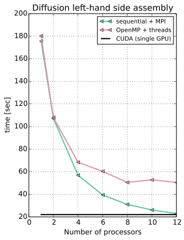
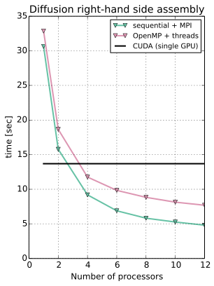

class: center, middle, inverse

# Backup

---

## Diffusion assembly on 1-12 cores/threads against CUDA baseline

.pull-left[

]

.pull-right[

]

---

## Assemble a diffusion operator 1000 times

