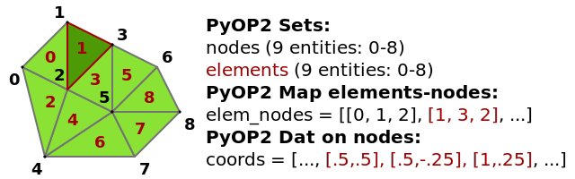
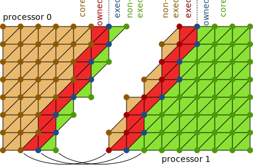
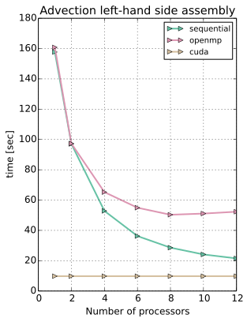
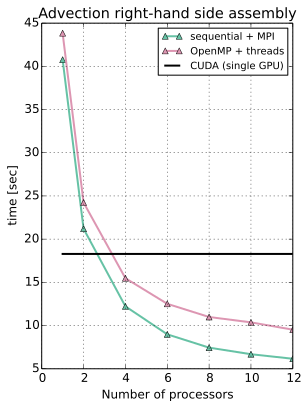

class: center, middle, inverse

# PyOP2: a performance-portable framework for parallel computations on unstructured meshes

## **Florian Rathgeber**<sup>1</sup>, Lawrence Mitchell<sup>1</sup>, David Ham<sup>1,2</sup>, Paul Kelly<sup>1</sup>

Slides: http://kynan.github.io/pdesoft2014

.footnote[<sup>1</sup> Department of Computing, Imperial College London
<sup>2</sup> Department of Mathematics, Imperial College London]

???

Good morning, my name is Florian and I work with a group of people at Imperial
College, some of which are in the room today, on a performance-portable
framework for parallel computations on unstructured meshes called PyOP2.

---

background-image:url(images/fem.svg)

???

Let me start with an unstructured application that is of particular relevance
for solving PDEs, the finite element method. I want to focus in particular on
assembly of the sparse linear system illustrated in this diagram. Given an
unstructured mesh like the one in the top left, assembly requires numerically
evaluating a problem- or PDE-specific integral for each element (or facet) of
the mesh. The nice property of the FEM we will make use of is that these
operations are *local* and *independent*, which means they're amenable to
parallelisation.

---

## Scientific computations on unstructured meshes

* Independent *local operations* for each element of the mesh described by a *kernel*.
* *Reductions* aggregate contributions from local operations to produce final result.

### PyOP2

* Domain-specific language embedded in Python for data parallel computations
* Efficiently executes kernels in parallel over unstructured meshes or graphs
* Portable programmes for different architectures without code change
* Efficiency through runtime code generation and just-in-time (JIT) compilation

### Unstructured mesh


???

FEM is an example of a class of scientific computations on unstructured meshes
characterised by *independent local operations* that need to be performed *for
every entity of the mesh* and can be described by a *computational kernel*.
Some operations are followed by a *reduction* which aggregates contributions
from these local operations. In FEM that is the assembly of the sparse linear
system.

What I am going to present to you today is a framework which abstracts this
concept and implements the efficient execution of parallel computations over
unstructured meshes on different hardware platforms.

PyOP2 is a domain-specific language embedded in Python for writing portable
programmes which efficiently run on different platforms without any changes to
the source. Portability and efficiency is achieved through generating
platform- and problem-specific code at runtime, just-in-time compiling it and
executing it natively.

---

## PyOP2 Data Model


.pull-left[
### Mesh topology
* ``Sets`` – Mesh entities and data DOFs
* ``Maps`` – Define connectivity between entities in different ``Sets``

### Data
* ``Dats`` – Defined on sets (hold fields: pressure, temperature, etc.)
* ``Globals`` – not associated to a ``Set`` (reduction variables, parameters)
* ``Consts`` – Global, read-only data
]

.pull-right[
### Kernels / parallel loops
* Executed in parallel on a ``Set`` through a parallel loop
* Read / write / increment data accessed via maps

### Linear algebra
* Sparsities defined by mappings
* Matrix data on sparsities
* Kernels compute a local matrix – PyOP2 handles global assembly
]

???

PyOP2 uses a number of simple primitives to describe unstructured meshes and
data defined on them:
* Set: abstractly defines class of entities, only know how big it is
* Map: defines connectivity between elements of sets
  * conceptually a "data parallel pointer"
  * lookup table: which entities of the target Set associated
    with an entitity of the source Set
* Dat: abstracted array, defined on a Set, contains actual values
  * Data can live in  CPU or GPU memory, partitioned for distributed parallel
  * PyOP2 manages storage, layout, access, transfer, halo exchange
  * "data parallel data"
  * mostly opaque
  * use like a vector: linear algebra operations
* Kernels / parallel loops:
  * define operations/computations to be performed independently for
    every entity of a given Set.
  * executed over the entire Set (or subset) in parallel (parallel loop)
  * can access data associated via Maps with one level of indirection
  * sequential semantics, local view of the data, defined by access descriptors
* Linear algebra:
  * Matrix defined on sparsity, which are defined by pairs of Maps
  * Parallel loops can assemble matrices from local assembly kernel
  * PyOP2 takes care of global assembly
* take home
  * PyOP2 objects are bare/simple objects with powerful semantics
  * tools to express higher-level objects/constructs e.g. FEM

---

## PyOP2 Architecture

.scale[]

???

PyOP2 architecture shown in this diagram:
* Provides unified API to the user (which may be another program, e.g. Firedrake)
* Declare data types, exectute parallel loops (dynamic construct)
* PyOP2 runtime schedules computation efficiently (colouring avoids data races)
* code generated and JIT compiled at runtime for different backends
* kernels executed over the mesh in native code
* CPU JIT: shell out to compiler to compile generated kernel + marshalling code
* use ctypes to load the compiled shared object
* 3rd party libraries (CPU: PETSc, GPU: Cusp) for sparse matrices, linear solvers

---

.left-column[
## PyOP2 Kernels & Parallel Loops

Kernels:
* "local view" of the data
* sequential semantics

Parallel loop:
* use access descriptors to generate marshalling code
* pass "right data" to kernel for each iteration set element
]
.right-column[
### Kernel for computing the midpoint of a triangle

```c
void midpoint(double p[2], double *coords[2]) {
  p[0] = (coords[0][0] + coords[1][0] + coords[2][0]) / 3.0;
  p[1] = (coords[0][1] + coords[1][1] + coords[2][1]) / 3.0;
}
```

### PyOP2 programme for computing midpoints over the mesh

```python
from pyop2 import op2
op2.init()

vertices = op2.Set(num_vertices)
cells = op2.Set(num_cells)

cell2vertex = op2.Map(cells, vertices, 3, [...])

coordinates = op2.Dat(vertices ** 2, [...], dtype=float)
midpoints = op2.Dat(cells ** 2, dtype=float)

midpoint = op2.Kernel(kernel_code, "midpoint")

*op2.par_loop(midpoint, cells,
*             midpoints(op2.WRITE),
*             coordinates(op2.READ, cell2vertex))
```

Kernels as abstract syntax tree (AST) or C string
]

???

Simple example programme: compute midpoint of all cells in mesh
* kernel: C string, local view of the data, sequential semantics
* parallel loop arguments: kernel, iteration set + access descriptors
* access descriptors match kernel parameters, define local view for the kernel
* fully programmatic via an AST, but there's a "back door": C string

---

## Generated sequential code calling the midpoint kernel

```c
// Kernel provided by the user
static inline void midpoint(double p[2], double *coords[2]) {
  p[0] = (coords[0][0] + coords[1][0] + coords[2][0]) / 3.0;
  p[1] = (coords[0][1] + coords[1][1] + coords[2][1]) / 3.0;
}

// Generated marshaling code executing the sequential loop
void wrap_midpoint(int start, int end,
                   double *arg0_0, double *arg1_0, int *arg1_0_map0_0) {
  double *arg1_0_vec[3];
  for ( int n = start; n < end; n++ ) {
    int i = n;
    arg1_0_vec[0] = arg1_0 + (arg1_0_map0_0[i * 3 + 0])* 2;
    arg1_0_vec[1] = arg1_0 + (arg1_0_map0_0[i * 3 + 1])* 2;
    arg1_0_vec[2] = arg1_0 + (arg1_0_map0_0[i * 3 + 2])* 2;
*    midpoint(arg0_0 + i * 2, arg1_0_vec);  // call user kernel (inline)
  }
}
```

---

## Generated OpenMP code calling the midpoint kernel

```c
// Kernel provided by the user
static inline void midpoint(double p[2], double *coords[2]) {
  p[0] = (coords[0][0] + coords[1][0] + coords[2][0]) / 3.0;
  p[1] = (coords[0][1] + coords[1][1] + coords[2][1]) / 3.0;
}

// Generated marshaling code executing the parallel loop
void wrap_midpoint(int boffset, int nblocks,
                   int *blkmap, int *offset, int *nelems,
                   double *arg0_0, double *arg1_0, int *arg1_0_map0_0) {
  #pragma omp parallel shared(boffset, nblocks, nelems, blkmap) {
    int tid = omp_get_thread_num();
    double *arg1_0_vec[3];
    #pragma omp for schedule(static)
    for ( int __b = boffset; __b < boffset + nblocks; __b++ ) {
      int bid = blkmap[__b];
      int nelem = nelems[bid];
      int efirst = offset[bid];
      for (int n = efirst; n < efirst+ nelem; n++ ) {
        int i = n;
        arg1_0_vec[0] = arg1_0 + (arg1_0_map0_0[i * 3 + 0])* 2;
        arg1_0_vec[1] = arg1_0 + (arg1_0_map0_0[i * 3 + 1])* 2;
        arg1_0_vec[2] = arg1_0 + (arg1_0_map0_0[i * 3 + 2])* 2;
*        midpoint(arg0_0 + i * 2, arg1_0_vec);  // call user kernel (inline)
      }
    }
  }
}
```

---

## Distributed Parallel Computations with MPI

.scale[]

???

* MPI: mesh needs to be decomposed using your favourite graph partitioner
* Computations on boundaries require up-to-date *halo* data
* Partial overlap: matching entities in matching colours in the diagram
* Enforce constraint on local mesh numbering for efficient comp-comm overlap
  i.e. constraint on the ordering of maps
* Contract: constraint has to be satisfied by PyOP2 user
* Local mesh entities partioned into four consecutive sections
  * **Core:** Entities owned by this processor which can be processed without
    accessing halo data.
  * **Owned:** Entities owned by this processor which access halo data when
    processed.
  * **Exec halo:** Off-processor entities redundantly executed over
    because they touch owned entities.
  * **Non-exec halo:** Off-processor entities which are not processed, but
    read when computing the exec halo.
* Entities that do not touch the boundary (core entities, by construction) can
  be computed while halo data exchange is in flight
* Halo exchange is automatic and happens only if needed i.e. halo is "dirty"

---

## Benchmarks

.pull-left[
### Hardware
* Intel Xeon E5-2620 @ 2.00GHz (Sandy Bridge)
* Nvidia GTX 680 GPU @ 1.006GHz (Kepler)
* 64GB RAM
]

.pull-right[
### Compilers
* gcc 4.7.3
* nvcc 5.0
* OpenMPI 1.4.5
]

### Problem setup: Advection-diffusion equation, split form
* tracer concentration $T$
* fluid of divergence-free velocity $\vec{u}$
* constant, isotropic diffusivity $D$

Advection:
`$$\int_\Omega pq \ \mathrm{d}x = \int_\Omega qT + {\rm dt} \ \nabla q \cdot \vec{u} \ T \
  \mathrm{d}x \quad \forall q \in V$$`
Diffusion:
`$$\int_\Omega pq + 0.5 \ {\rm dt} \ D \ \nabla q \cdot \nabla p \ \mathrm{d}x =
  \int_\Omega qT - 0.5 \ {\rm dt} \ D \ \nabla T \cdot \nabla q \ \mathrm{d}x
  \quad \forall q \in V$$`

---

## Advection assembly on 1-12 cores/threads against CUDA baseline

.pull-left[

]

.pull-right[

]

???

* CUDA kernel uses many resources:
  * 57 registers, 28.608K of shared memory
  * theoretical occupancy of 6.25%
  * only 1/16 SMX units on the 680 can be used
  * up to 64 DP FMAs at half the clock speed of a Xeon core...

---

## Summary and Preview

### Summary
* PyOP2: a high-level interface to unstructured mesh based methods  
  *Efficiently execute kernels over an unstructured mesh in parallel*
* Write programmes portable between architectures without code change
* Unified API, targeting multi- and many-core architectures
* Mesh topology described by sets of entities and mappings between them
* Dat as abstracted vector, managing storage, transfer, halo exchange
* Problem-specific runtime code generation and JIT compilation
* Execution layer for higher-level applications: finite element computations
  (Firedrake), finite volume, image processing, ...

--

### Preview
* Solving PDEs on extruded (semi-structured) meshes:  
  *Lawrence Mitchell's talk this afternoon*
* PyOP2 as execution layer of the finite element framework Firedrake:  
  *David Ham's keynote talk on Wednesday*

---

## Thank you!

Contact: Florian Rathgeber, [@frathgeber](https://twitter.com/frathgeber), <f.rathgeber@imperial.ac.uk>

### Publications

* *[PyOP2: A High-Level Framework for Performance-Portable Simulations on Unstructured Meshes](http://dx.doi.org/10.1109/SC.Companion.2012.134)*
  Florian Rathgeber, Graham R. Markall, Lawrence Mitchell, Nicholas Loriant, David A. Ham, Carlo Bertolli, Paul H.J. Kelly,
  WOLFHPC 2012
* *[Performance-Portable Finite Element Assembly Using PyOP2 and FEniCS](http://link.springer.com/chapter/10.1007/978-3-642-38750-0_21)*
   Graham R. Markall, Florian Rathgeber, Lawrence Mitchell, Nicolas Loriant, Carlo Bertolli, David A. Ham, Paul H. J. Kelly,
   ISC 2013

### Resources

**PyOP2** (open source, BSD licensed): https://github.com/OP2/PyOP2

Clone it and try it out for your problem!

**This talk** is available at http://kynan.github.io/pdesoft2014 ([source](https://github.com/kynan/pdesoft2014))

Slides created with [remark](http://remarkjs.com)

???

* invite everyone to download and try PyOP2 and see if it has advantages for what you are doing
